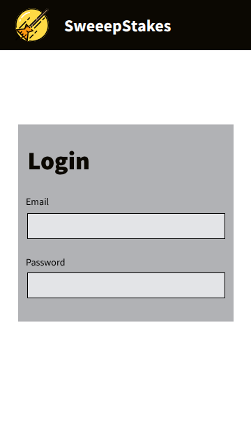
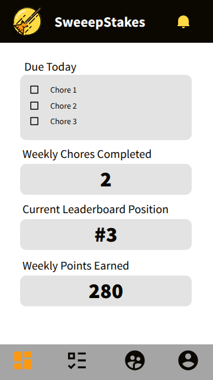
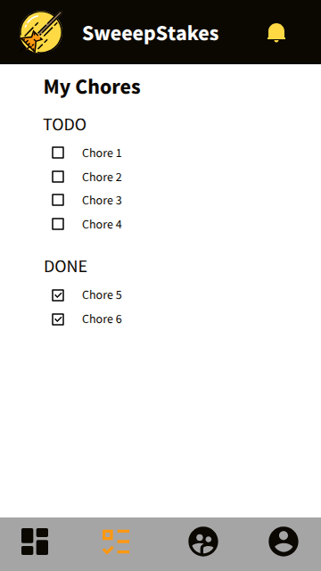
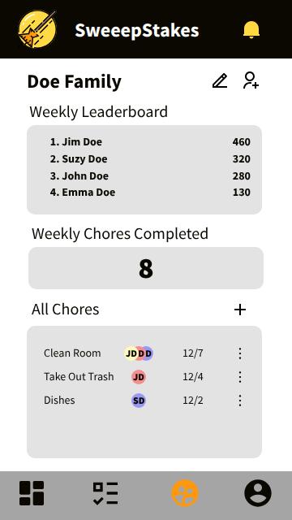
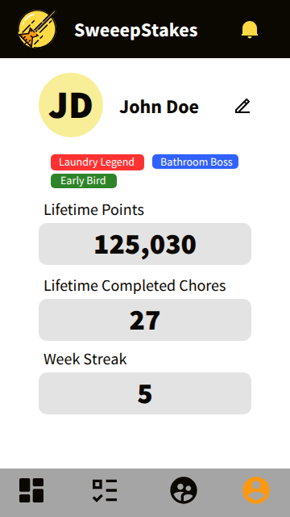
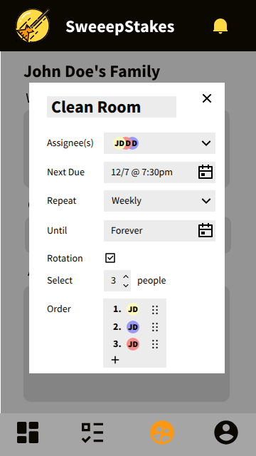

# 🧹 Sweeepstakes

Sweeepstakes is a real-time chore coordination app that helps roommates and families manage tasks, track progress, and earn fun badges. It’s designed to make shared living smoother and a little more competitive — in a good way.

## Index

- [Elevator Pitch](#elevator-pitch)
- [Design](#design)
- [Key Features](#key-features)
- [Technologies](#technologies)
- [Deployment Instructions](#deployment-instructions)

## Elevator Pitch

Say goodbye to the constant pile of dishes in your sink! Sweeepstakes makes chores fun and more coordinated. Perfect for families or roomates in a shared living space. Do you like a good freindly competition? Now you can see who is the best at getting their chores done. Show off your laundry folding skills with a nice profile badge.

Users can join a household group, assign chores, track completion, and earn badges for their contributions. Real-time updates keep everyone in sync.

## Design

### Login

### Dashboard

### Chores

### Group

### Profile

### Chore Edit Modal

## Key Features

- Group creation and chore assignment
- Real-time updates for task completion
- Badge rewards for milestones
- Clean, responsive UI

## Technologies

- **HTML** – Static layout for login, dashboard, and chore form
- **CSS** – Responsive design and chore status styling
- **React** – Refactor into components and add routing
- **Service** – Backend endpoints
  - Login
  - Get user assigned chores
  - Edit/Create chore and edit status
  - Edit group info
  - User info
  - Leaderboard info
  - Third Party Endpoint:
    - shields.io for badge generation
- **Database** – Keep track of info for users, groups, chores, leaderboard
- **WebSocket** – Real-time updates of leaderboard/points

## Deployment Instructions

- Clone the repo
- Install dependencies
- Set environment variables
- Run the server
